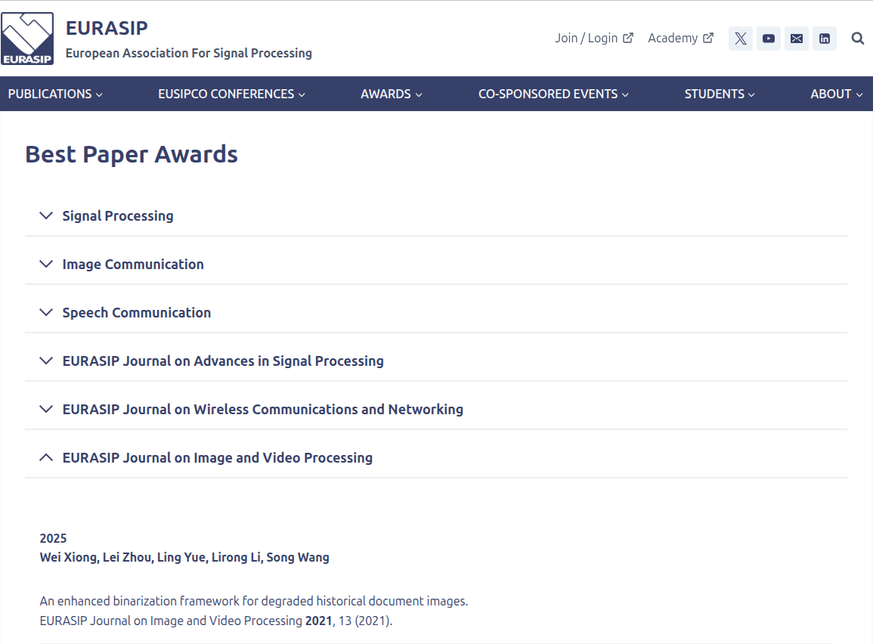
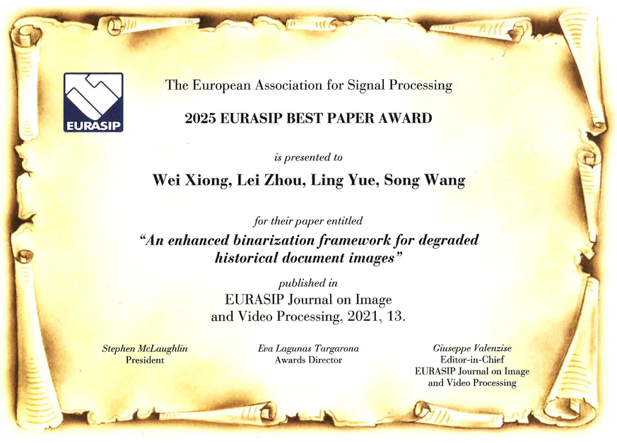

# H-DIBCO-2018

## News Update:

- 2025/10: The European Association for Signal Processing (EURASIP) has updated the “Best Paper Awards” section on its official website. Please click [here](https://eurasip.org/best-paper-awards/).



- 2025/09: Our paper entitled **An enhanced binarization framework for degraded historical document images** has been selected as the "**Best Paper Award 2025**" by the **_EURASIP Journal on Image and Video Processing_** (JIVP).



- 2018/08: Our Laplacian energy-based segmentation method (H-DIBCO2018-HBUT) achieved the Best performance in **ICFHR 2018 competition on handwritten document image binarization (H-DIBCO 2018)** [1], and the 2<sup>nd</sup> Best performance in _Challenge A_ of **ICFHR 2018 competition on document image analysis tasks for Southeast Asian palm leaf manuscripts** [2].

**H-DIBCO2018-HBUT:** _Wei XIONG, Zijie XIONG, Xiuhong JIA, Min LI_

> We first perform the morphological bottom-hat transform to compensate the document background with a disk-shaped structuring element, the size of which is determined by the stroke width transform (SWT) [3]. We then apply the Howe’s binarization method [4] on the compensated document images to further segment the foreground and background pixels. Finally, we carry out the image post-processing to produce better results.

**If the code is helpful to your research, please cite the following papers:**

```bibtex
@article{Xiong2021,
title = {An enhanced binarization framework for degraded historical document images},
journal = {EURASIP Journal on Image and Video Processing},
author = {Xiong, Wei and Zhou, Lei and Yue, Ling and Li, Lirong and Wang, Song},
volume = {2021},
article number = {13},
year = {2021},
doi = {10.1186/s13640-021-00556-4},
note = {2025 EURASIP Best Paper Award},
}

@inproceedings{Xiong2018,
title = {Historical document image binarization using background estimation and energy minimization},
journal = {24th International Conference on Pattern Recognition (ICPR 2018)},
author = {Xiong, Wei and Jia, Xiuhong and Xu, Jingjing and Xiong, Zijie and Liu, Min and Wang, Juan},
year = {2018},
pages = {3716-3721},
address = {Beijing, CHINA},
doi = {10.1109/icpr.2018.8546099},
}
```

References

[1] I. Pratikakis, K. Zagoris, P. Kaddas, B. Gatos, "ICFHR 2018 competition on handwritten document image binarization (H-DIBCO 2018)," in Proceedings of the *16th International Conference on Frontiers in Handwriting Recognition (ICFHR 2018)*, Niagara Falls, USA, 2018, pp. 489-493. doi: 10.1109/icfhr-2018.2018.00091

[2] M. W. A. Kesiman, D. Valy, J.-C. Burie, E. Paulus, M. Suryani, S. Hadi, M. Verleysen, S. Chhun, J.-M. Ogier, "ICFHR 2018 competition on document image analysis tasks for Southeast Asian palm leaf manuscripts," in Proceedings of the *16th International Conference on Frontiers in Handwriting Recognition (ICFHR 2018)*, Niagara Falls, USA, 2018, pp. 483-488. doi: 10.1109/icfhr-2018.2018.00090

[3] B. Epshtein, E. Ofek, Y. Wexler, "Detecting text in natural scenes with stroke width transform," in Proceedings of the *2010 IEEE Conference on Computer Vision and Pattern Recognition (CVPR 2010)*, San Francisco, CA, 2010, pp. 2963-2970. doi: 10.1109/cvpr.2010.5540041

[4] N. R. Howe, "Document binarization with automatic parameter tuning," *International Journal on Document Analysis and Recognition*, vol. 16, no. 3, pp. 247-258, 2013. doi: 10.1007/s10032-012-0192-x
